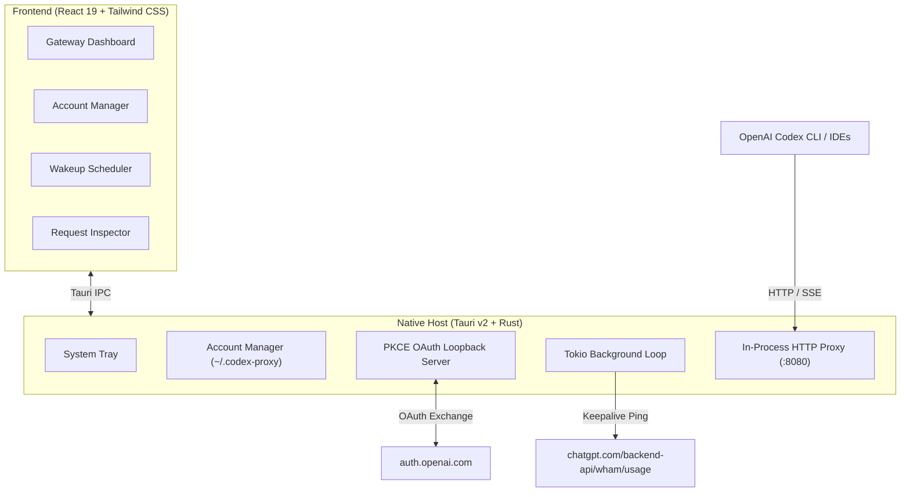

# CodexProxy

A high-performance, developer-grade desktop gateway and multi-account manager engineered specifically for **OpenAI Codex**. Built with **Tauri v2 + Pure Rust** and **React 19**, CodexProxy replaces bloated multi-IDE tools with a lightweight, secure, and native desktop solution.


---

## Key Features

- **Pure Rust In-Process Gateway**: Listens on `http://127.0.0.1:8080` without any external sidecars (no Go runtimes, no Electron overhead).
- **Dual Protocol Support**:
  - **Codex Responses Wire API**: Full Server-Sent Events (SSE) lifecycle support (`response.created`, `response.output_item.added`, `response.output_text.delta`, `response.output_item.done`, `response.completed`).
  - **OpenAI Chat Completions API**: Full compatibility with standard OpenAI clients, Cursor, Cline, and Roo-Code (`/v1/chat/completions` non-streaming and chunked SSE streaming).
- **Real OpenAI PKCE OAuth Engine**:
  - Ephemeral loopback TCP server for zero-leak authorization code interception.
  - S256 code challenge generation and direct token exchange (`https://auth.openai.com/oauth/token`).
- **Wakeup Task Engine**:
  - Background Tokio scheduler loop running keepalive warmup pings (`chatgpt.com/backend-api/wham/usage`) to start and maintain the rolling 5-hour quota reset timer early.
- **Native macOS & Windows Experience**:
  - Custom dark theme inspired by Linear and Raycast.
  - Native system tray integration with background minimization.
  - Zero-retention proxy design: credentials remain local in `~/.codex-proxy/`.

---

## Getting Started

### Prerequisites
- Node.js 20+ & npm
- Rust 1.75+ (`rustup`)
- macOS (Apple Silicon / Intel) or Windows 10/11

### Development
```bash
# Clone the repository
git clone https://github.com/tonminhce/codex-proxy.git
cd codex-proxy

# Install frontend dependencies
npm install

# Run in development mode with hot reloading
npm run tauri dev
```

### Production Build
```bash
# Compile native desktop installer
npm run tauri build
```

---

## Using with OpenAI Codex CLI

You can point the official `codex` CLI directly to the local proxy:

```bash
codex exec \
  -c model_provider="codex_local_access" \
  -c model_providers.codex_local_access.base_url="http://127.0.0.1:8080/v1" \
  -c model_providers.codex_local_access.wire_api="responses" \
  -c model_providers.codex_local_access.requires_openai_auth=false \
  -c model_providers.codex_local_access.supports_websockets=false \
  "Your prompt here"
```

Or configure it permanently in `~/.codex/config.toml`:

```toml
model_provider = "codex_local_access"

[model_providers.codex_local_access]
name = "CodexProxy Gateway"
base_url = "http://127.0.0.1:8080/v1"
wire_api = "responses"
requires_openai_auth = false
supports_websockets = false
```

---

## Architecture



---

## License

MIT License. Engineered for developers.
